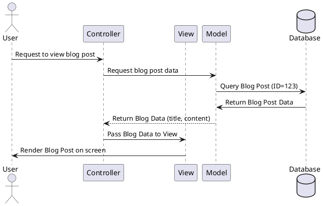
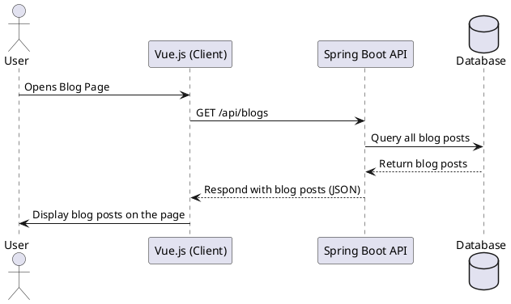
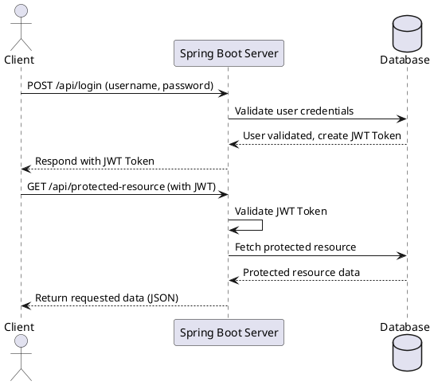

# MVC

MVC stands for **Model-View-Controller**. It's a design pattern used in software development, especially in web applications, to separate the app into three interconnected parts. This helps organize code better and makes it more manageable and scalable.

## M - Model

It is responsible for handling the **data** part of your application.\

- The model manages the information — it deals with data.
- <mark style="background: #FFF3A3A6;">It gets data from other parts of your system (such as a database) and provides it to whoever needs it.</mark>
- It <mark style="background: #FFB86CA6;">doesn’t care about how things are displayed or how users interact with the system</mark> — it's just about managing data.

## V - View

In MVC, the **View** is the part that **displays** the information — what the user actually interacts with on their screen.

- It takes data from the Model and <mark style="background: #FFF3A3A6;">displays it to the user</mark> in a nice way.
- The view is <mark style="background: #FFF3A3A6;">all about presentation</mark> — what should the page or interface look like? How are things structured on the screen?

## C - Controller

This part is responsible for <mark style="background: #FFF3A3A6;">handling **user input** and deciding what to do with it</mark>.

- When a user interacts with the application (like clicking a button or submitting a form), the controller is notified.
- The controller talks to the model to get or update data and then tells the view what to show.

## Quick Example

Imagine building a blog app:

1. **Model:** Manages the blog post data (content, author, date) and stores it in the database.
2. **View:** Displays the blog posts in HTML/CSS, for example.
3. **Controller:** Links things together — when a user submits a new post, the controller takes that input, tells the model to save it, and then updates the view to show the newly created post.




# Spring Boot + Vue

## Spring Boot

**Spring Boot** is a **Java framework**. It’s mostly used for building **back-end** services like APIs (or microservices).

- It helps you quickly create Java-based web applications or back-end APIs.
- It makes it easier to build server-side applications without worrying about complex configuration.
- It handles things like **databases**, **transactions**, and **business rules**.

## Vue.js

- **Vue.js** is a modern **JavaScript framework** that helps developers create **front-end** User Interfaces (UI) — basically what users see and interact with on a website.
- It’s used for building interfaces where your end-users can fill out forms, click buttons, and view content.
- It provides a **smooth user experience**.

## Together?

## Communicate?

**REST APIs** or **HTTP endpoints**

-  A **REST API** (Representational State Transfer Application Programming Interface) is a way for different software systems (like a **front-end** and **back-end**) to talk to each other using the **HTTP** protoco
- An **HTTP endpoint** is a specific **URL** (Uniform Resource Locator) that your app uses to access or interact with the REST API.



### REST

**Representational State Transfer**

1. **Statelessness:**
	1. each request from the client to the server must contain all the information the server needs to understand and process the request
	2. The **server** doesn't store anything about the client to “remember” between different requests.
2. **Resource-Oriented:**
    - **Everything** (like users, blog posts, photos, etc.) is treated as a **resource**.
    - You access these resources through **URLs** (web addresses).
3. **Uniform Interface:**
    - REST uses a **predictable** way to interact with resources.
    - It relies on **HTTP verbs** like:
        - **GET**: To read/fetch data (like asking the server for a blog post).
        - **POST**: To create data (like creating a new blog post).
        - **PUT/PATCH**: To update data (like editing a blog post).
        - **DELETE**: To delete data (like removing a blog post).
4. **Client-Server Separation:**
5. **Use of Representations:**

### How Does the Server Verify Who the Client Is in REST?

In stateless REST APIs, the server verifies who the client is by requiring **authentication credentials** in **every request**. This is often done using methods such as:

1. **Token-Based Authentication** (the most common, using **JWT** or similar).
2. **API Keys**.
3. **OAuth** (for third-party authorization, like logging in with Google/Facebook)

### JWT - Json Web Tokens

- Since REST is **stateless**, every time the client makes a request to the server (like asking for data, updating something, or deleting an item), it sends the **JWT in the HTTP header** with the request.

```
GET /api/protected-data
Authorization: Bearer <JWT_TOKEN>
```


