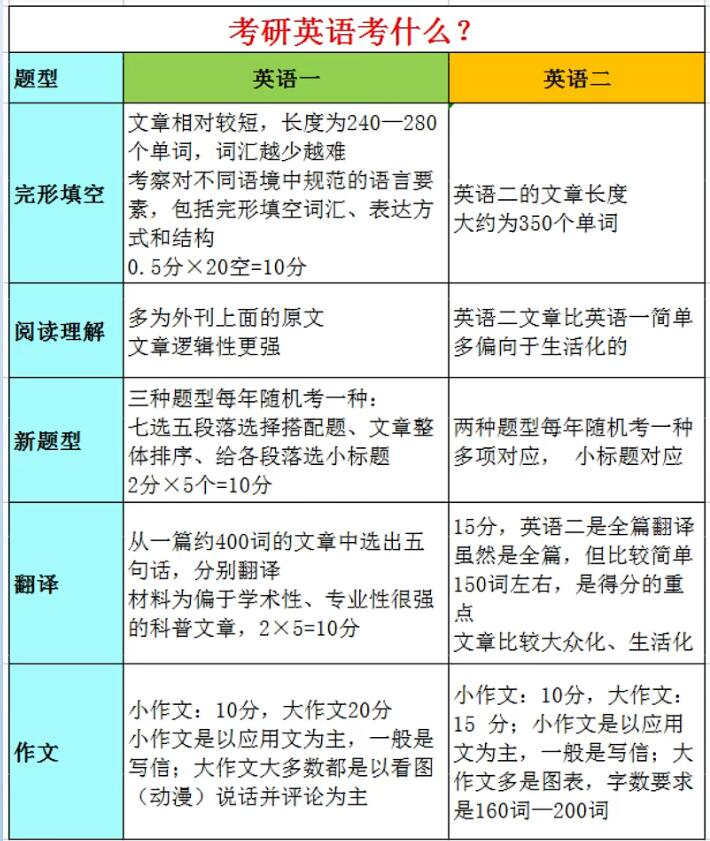
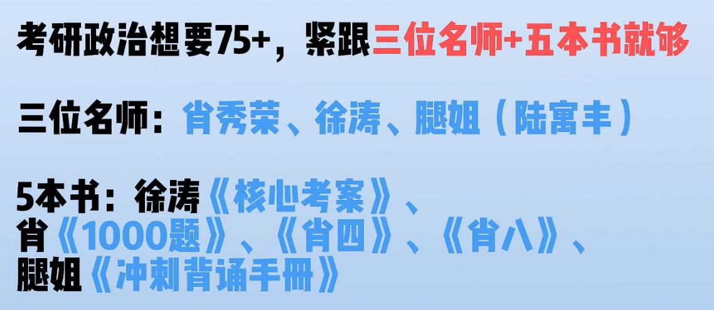

## 1. 24考研流程
- 23年9月，各院校发布考试大纲，
- 23年9月中旬，预报名
- 23年10月中旬，正式报名，要写==报考学校+专业+院系+方向==
- 23年11月中旬，确认报名，==必须确认==
- 23年12月，下载准考证，最后一周周末参加考试
- 23年2-3月公布成绩，公布国家线和自划线，开始复试、调剂
- 23年5月复试调剂结束
- 24年4-6月正式录取
- 24年9月入学

## 2. 国家线和自划线的区别
- 国家线就是统一的进入复试的基本分数要求
- 自划线是有自主划线权的学校自己划定，超过该线就可以参加其院校复试
- 必须同时满足==每门科目和总分都过线==
- A类考生，B类考生：根据指你想考的院校所在地区划分（吉林是A类地区）

## 3. 学硕和专硕的区别
- 学硕：学术型硕士，考试难度比专硕高，学制一般3年，偏研究，可申请连读
- 专硕：专业型硕士，考试难度稍低，学制2-3年，偏向实践，需要考博

## 4. 考研英语
- 3小时，100分，题型如下

- 老师选择见 [妈耶！终于有人把24考研说清楚了！（考研流程、择校、各科目考什么、选什么资料、看谁的网课...）一目了然_哔哩哔哩_bilibili](https://www.bilibili.com/video/BV16M4y197QR/?spm_id_from=333.337.search-card.all.click&vd_source=ac2e1ae4d81a40e4b6f5fef5c9e98ff9) 
## 5. 考研数学
- 分为高数、线代、概率论

## 6. 考研政治
- 3小时，100分
- 题型：单选16题16分、多选17题34分、分析5题50分
- 范围：马原、毛中特、近代史、思修、时政（待考证，因为2023有习思想了）
- 政治基本上从现在（23年暑假）开始准备刚好
- 

## 7.专业课
- 3小时
- 需要登陆目标院校研究生官网查看简章
- 招生简章上的参考书籍、目标院校的真题（从微博超话、院校官网上找）