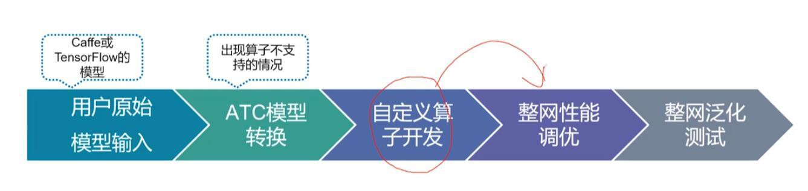
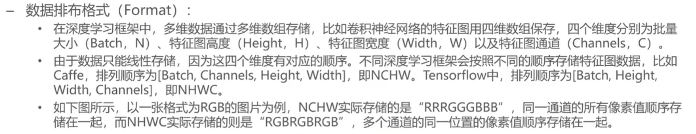
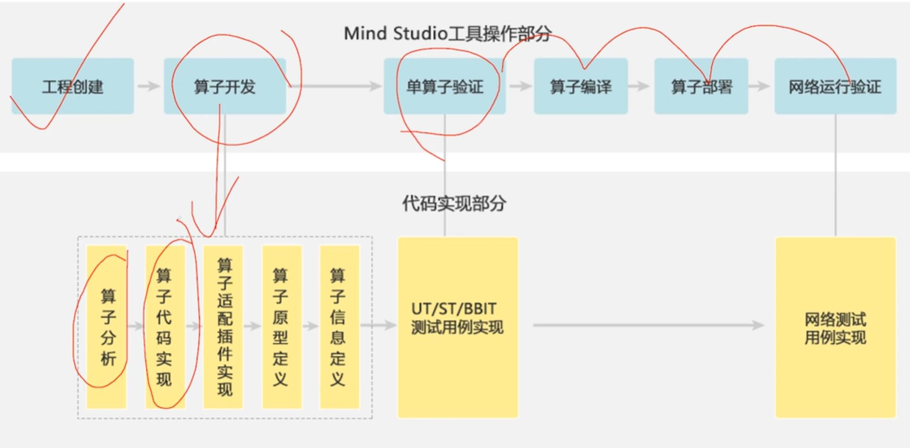
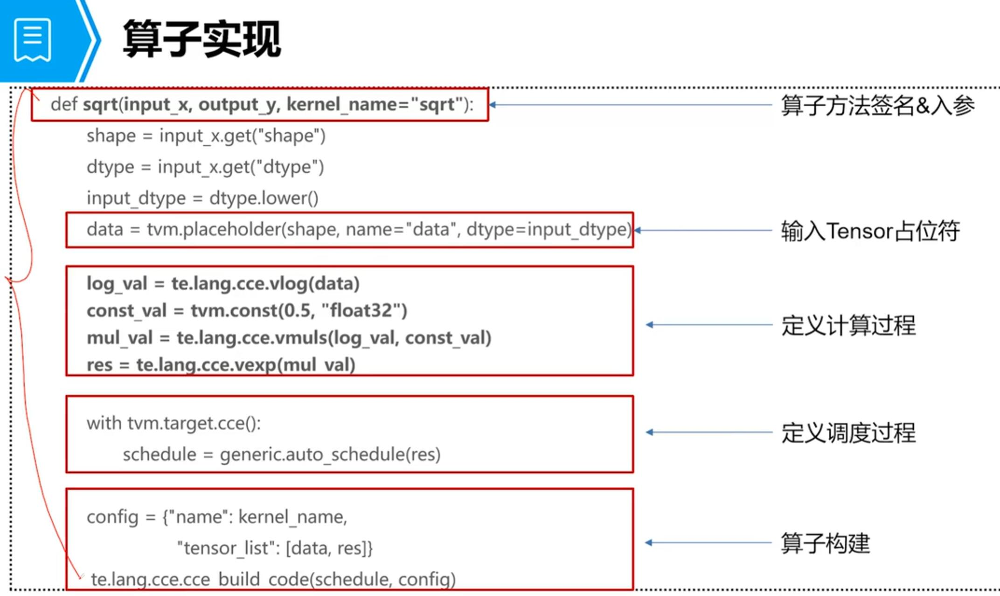

## 1. TBE 算子基本知识
- 
- 模型转换，就是把开源框架的网络模型，通过 `ATC（Ascend Tensor Compiler）` 模型转换工具，将其转换成昇腾AI处理器支持的离线模型（OM模型）。 
- 有几种情况下，需要自己开发算子：
  1. 网络新，算子没有开发或发布
  2. 原框架的算子，在新框架下需要重新适配
  3. 泛化程度不够，数据大小不支持
- TBE，Tensor Boost Engine，华为自研的算子开发工具，运行在NPU上，在 `TVM（Tensor Virtual Machine）` 框架上扩展，提供 `Python API`
- 算子的类型（Type）表示算子的运算，算子的名称（Name）用于唯一标识算子。
- **张量（Tensor）**：数据的集合，可能有多维，属性有名称
、形状、数据类型、数据排布格式。
 - **广播（Broadcast）**：将一个数组的每一个维度扩展为一个固定的shape,需要被扩展的数组的每个维度的大小或者与目标shape相等，或者为1,广播会在元素个数为1的维度上进行。

## 2. TBE 算子开发流程
- 开发方式：
	- DSL：Domain Specific Language，容易，仅需要了解神经网络和TBE DSL相关知识
	- TIK：Tensor Iterator Kernal，难，需要了解 `Davinci` 硬件缓冲区架构，对性能要求高，用户需要自己掌握数据流以及算子的硬件调度

1. 算子实际上就是python的一个方法
2. 
3. 