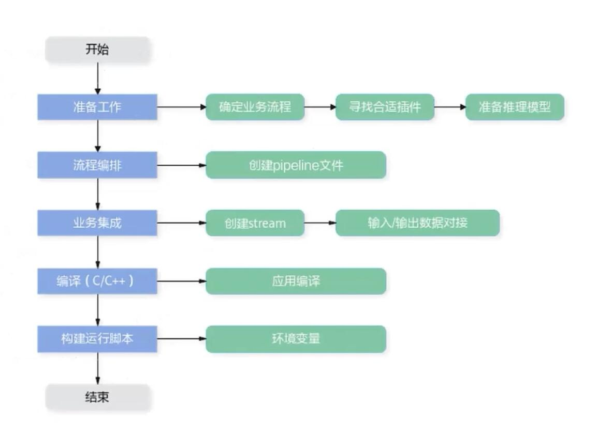
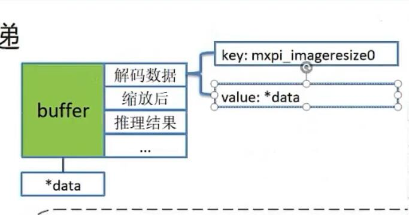

## 0.注意点
- 可以使用ATC工具将pytorch的onnx模型转换为om模型
- 使用 `# npu-smi info` 查看推理卡型号，如 `310B4` ，需要在 `run.sh` 中，把推理卡的型号更改为正确的型号
## 1. MindX SDK 的使用
1. SDK开发流程

2. MindSDK中有一系列的插件，每一个插件对应一个小工作，确定流程后可以通过每一步骤的功能找到对应合适的插件，具体见文档
3. 
## 2. 了解 pipeline 文件的创建
1. 流水线的思想在这里仍然适用，pipeline文件就是一个描述流水线每一个步骤的json文件，需要指明下一个需要用到的插件

3. 以buffer的数据结果存放整个流程中的所有结果，
   

## 3. 根据样例学习 MindX SDK的使用
- [适配200DK的安全帽识别-昇腾社区 (hiascend.com)](https://www.hiascend.com/zh/marketplace/mindx-sdk/case-studies/a686c5d4-85b9-4971-9f0b-c49874d1d9da)
- [电力绝缘子检测-昇腾社区 (hiascend.com)](https://www.hiascend.com/zh/marketplace/mindx-sdk/case-studies/abb49ce2-8a74-43e6-9b48-5c397c44e1ad)