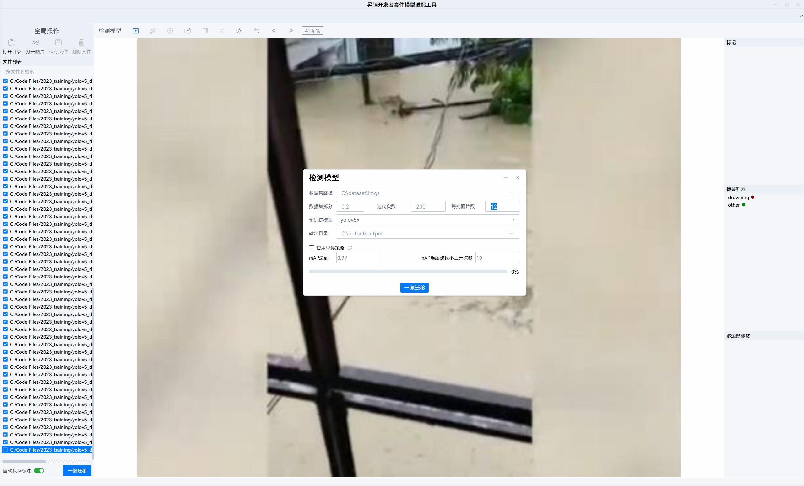

## 1. 作品背景、应用场景与价值

- 背景：考虑到近几年气候异常，极端天气较多，且国内部分地区常受台风天气影响，经常产生洪涝等灾害。为了保障人民的生民安全，我们设计了一款洪水中溺水者检测装置。更改模型来源，这款装置同样可以用于游泳池、水库等易发生溺水事故的地区。
- 应用场景：可以由安全员实现安装在台风、洪水发生时，易产生大量积水的地区/游泳池/水库。当发生警报，安全员可以立马响应。或与其他安全设施搭配，如自动弹出救生圈、自动弹出救生绳等等。
- 价值：在上述环境下，用于保障人民群众生命安全。

## 2. 使用昇腾AI全栈能力的范围

- 在标注数据集和训练时，使用了 `Ascend AI Devkit Model Adapter（昇腾模型适配工具）` ，其中集成了 `分类模型、检测模型、分割模型、关键点模型` 。我们使用了集成好的 `yolov5s预训练模型` ，在 Windows 主机上使用 CPU 资源训练数据集，得到训练结果。
- 我们使用 `Atlas 200I DK A2` 开发板进行推理，上面集成了 `昇腾310B AI处理器` ，最高可提供 `8TOPS INT8` 的计算能力，可以实现图像、视频等多种数据分析与推理计算，完美契合我们的应用。

## 3. 作品创新创意点

- 巧妙利用集成了 `昇腾310B AI处理器` 的开发板，用预训练好的模型进行推理，合理使用了开发板的算力，为保障人民生命安全保驾护航。

## 4. 作品使用说明

### &emsp;硬件设备

- 华为昇腾Atlas 200I DK A2开发板 \* 1
- USB摄像头 \* 1
- USB扬声器 \* 1
- RJ45 网线 \* 1
- 已经成功连接开发版的电脑 \* 1

### &emsp;软件环境

- 解压 `drowning_detector` 到开发板有执行权限的正常目录下
- 到解压完毕的目录下
- `pip install -r requirements.txt` 下载所需包
- 检查USB摄像头、USB扬声器是否能够正常使用
- 运行即可：

```python
python om_infer_app.py
```

### &emsp;运行参数

```Bash
python om_infer_app.py --input-dir [path] # 指定摄像头图像保存的目录，默认为 test/images
                        --model [path] # 指定检测模型，默认为 output/yolov5s_bs1.om
                        --device-id [num] # 指定推理用运算设备编号，默认为 0
                        --output-dir [path] # 指定检测结果存放文件夹，默认为 output
                        --camera-id [num] # 指定摄像头设备编号，默认为 0
                        --conf [0~1] # 指定置信系数，默认为 0.25，不推荐改得太高
                        --warning [path] # 指定警报音乐目录，默认为 warning_sound.mp3
                        --cnt [num] # 指定检测到多少数量的疑似溺水人员触发警报，默认为 25
                        --max-save [num] # 指定保存摄像头画面和识别结果的数量，默认为 200
```

## 5. 开发过程

1. 在网络上搜集数据集，主要来源为：

[drown object detection | Roboflow Universe Search](https://universe.roboflow.com/search?q=drown%20object%20detection)

[溺水者 洪水_百度图片搜索 (baidu.com)](https://image.baidu.com/search/index?tn=baiduimage&ps=1&ct=201326592&lm=-1&cl=2&nc=1&ie=utf-8&dyTabStr=MTEsMCwxLDMsNiw0LDUsMiw3LDgsOQ%3D%3D&word=%E6%BA%BA%E6%B0%B4%E8%80%85+%E6%B4%AA%E6%B0%B4)

[drowning_flud (google images)](https://www.google.com/search?sxsrf=AB5stBh_xezQQaD1MVQDmy10NP0-tD09Nw:1691657796471&q=drowning+flud&tbm=isch&source=lnms&sa=X&ved=2ahUKEwiqzqiw3NGAAxWE_mEKHUSzBxAQ0pQJegQIChAB&biw=1631&bih=913&dpr=1.56)

2. 使用 `Ascend AI Devkit Model Adapter (昇腾模型适配工具)` 进行标注，一键迁移，使用 Windows电脑上的 CPU 资源进行模型训练
- 标注时分为两类，0: drowning，1: other，具体规则如下：
  
    判定drowning的原则：
  
  1. 平静的水面情况下水没至脖子，或较汹涌的水面没至上半胸部
  
  2. 其他明显溺水的情况
     
     判定other的原则：
  
  3. 过于模糊的、过小的、背景中的人不判定
  
  4. 多人重叠部分过多，只指定最容易识别的一两个
  
  5. 若难以选定单人，则同时选定人和物品
3. 得到训练完毕的文件，上传到 `Atlas 200I DK A2 开发板` 中。
4. 参考 [官方文档](https://www.hiascend.com/document/detail/zh/Atlas200IDKA2DeveloperKit/23.0.RC1/Getting%20Started%20with%20Application%20Development/iaqd/iaqd_0010.html) 格式等。
5. 参考 `om_infer.py` ，加上自己的摄像头捕获、计数、计时、播放警告、显示图像等逻辑，编写 `om_infer_app.py` 。具体运行方式见 `4.作品使用说明`。